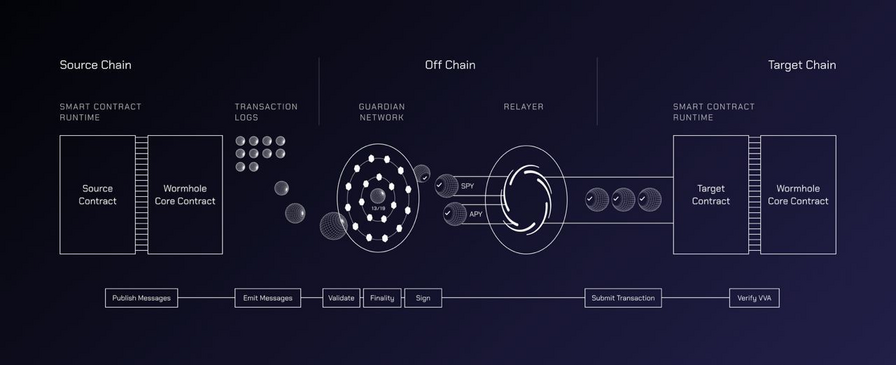
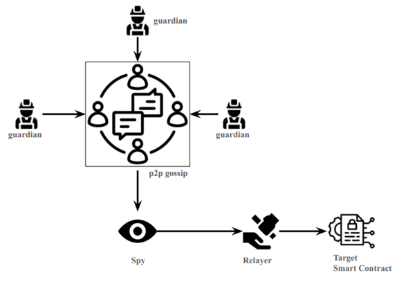
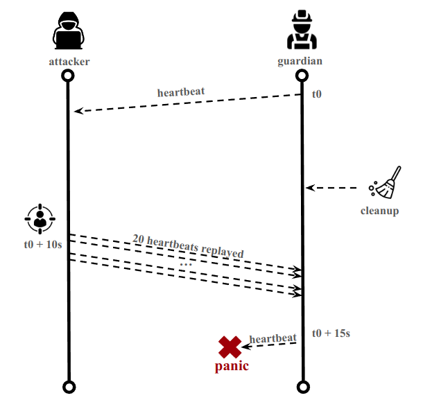

<!--more-->

## 1. Introduction

We discovered a vulnerability within the p2p implementation of Wormhole that would have allowed an external attacker to crash the Guardian network. The attack was non-volumetric, easy to reproduce, but difficult to catch. The difficulty came from the fact it was a *second-order attack*, meaning the hacker attacks the victim, but the exploit would be triggered by the victim itself at a later stage.


### Wormhole and Guardians

Wormhole uses a set of smart contracts in combination with a Guardian network to operate.


Guardians play a critical role for the functioning of Wormhole.
As per the documentation:
> Wormhole relies upon a set of distributed nodes that monitor the state on several blockchains. In Wormhole these nodes are referred to as Guardians. (...)
> It is the Guardian's role to observe messages and sign the corresponding payloads. Each Guardian performs this step in isolation, later combining the resulting signatures with other Guardians as a final step. 

Guardians combine their results by communicating with each other through a p2p gossip network (based on the library *libp2p*).

Each actor on the p2p network is identified by a **PeerId**, determined by a private key that the node has generated. Guardians send broadcast messages on the gossip network, meaning everyone will receive them. 
Other actors (**Spies**) can join the gossip network, and listen to the messages sent by the Guardians.
Those messages can be:
- Verified Action Approvals (VAA)
- Observations
- *Heartbeats*

The primary role of the **Spy** is to catch the VAA and send them to **Relayers**, who will perform the interaction on the target chain.
Below is a schema that summarizes the different actors.


We identified 2 interesting behaviours of the gossip p2p network:
- **Lack of access control**: Not only Guardians can send messages. Anyone can send messages on gossip, even Spies, or any rogue client. Those messages will be interpreted by the Guardians.
- **Lack of anti-replay mechanism**: Anyone can replay *Heartbeats*: Guardians will not check if they have already received a message.

From here we tried to use these facts to see if we could crash the p2p network.

### First attempt: High Cardinality Attack

With the previous information we tried to find attack vectors. The first promising one was **High-Cardinality Attacks.** You can check [this vulnerability](https://github.com/open-telemetry/opentelemetry-go-contrib/security/advisories/GHSA-5r5m-65gx-7vrh) for reference.
Those attacks occur when an external attacker can add lots of lines in the Prometheus metrics, increasing CPU/RAM consumption.

As mentioned [here](https://last9.io/blog/how-to-manage-high-cardinality-metrics-in-prometheus/) :
> This can have implications for the performance and scalability of Prometheus, as each distinct label combination creates a separate time series in the system. A high cardinality can increase memory usage, CPU usage, longer query times, and higher storage requirements.

Because the information of the p2p *PeerId* is random (depends on a generated secret key), and because the information about the *PeerId* is added in the metrics when a message is replayed, an external attacker can perform the attack by replaying old messages with a rogue client, and regularly change his *PeerId*. Because each Guardian listens to the p2p, this would impact all Guardians at the same time.

To go into details in the code:
In the p2p.go file, there is a **Switch Case** that deals with received messages by Guardians.
```golang
switch m := msg.Message.(type) {  
   case *gossipv1.GossipMessage_SignedHeartbeat:  
(...)
   case *gossipv1.GossipMessage_SignedObservation:  
(...)
   case *gossipv1.GossipMessage_SignedVaaWithQuorum:  
(...)
   case *gossipv1.GossipMessage_SignedObservationRequest:  
(...)
   case *gossipv1.GossipMessage_SignedChainGovernorConfig:  
(...)
   case *gossipv1.GossipMessage_SignedChainGovernorConfig:  
(...)
   default:  
```

If we take the example of `GossipMessage_SignedHeartbeat` :
```golang
case *gossipv1.GossipMessage_SignedHeartbeat:
(...)
if Heartbeat, err := processSignedHeartbeat(envelope.GetFrom(), s, gs, gst, disableHeartbeatVerify); err != nil {
```

The function that will treat the *Heartbeat* is `processSignedHeartbeat()` :
```golang
func processSignedHeartbeat(from peer.ID, s *gossipv1.SignedHeartbeat, gs *common.GuardianSet, gst *common.GuardianSetState, disableVerify bool) (*gossipv1.Heartbeat, error) {
(...)
collectNodeMetrics(signerAddr, from, &h) 
return &h, nil
} 
```

In the end, the function `collectNodeMetrics(signerAddr, **from**, &h)`  will update the metrics, with the *PeerId* that was given by the attacker.

The actual sender (p2p node) is **from**, which is a *PeerId* defined by its private key. This information is never checked within the function to ensure the *PeerId* is legitimate, meaning checking if it matches the real *PeerId* of the guardian having sent the *Heartbeat* **h**.

An external attacker can therefore:
1. Join the p2p network with a rogue client,
2. Replays *Heartbeats*,
3. Change their *PeerId* by recreating a secret key,
4. Go back to Step 1

By doing so, this will add metrics and the table will grow in size (+150/200 lines in the metrics for each new *PeerId*) because the new *PeerId* will be associated with all the metrics (different blockchains, versions, etc). Also, because of the p2p infrastructure, the rogue messages will be treated by the 18 Guardians that did not send the message, amplifying the attack. This could lead to a Denial-of-Service.

We can see that cardinality attack is a concern for Wormhole in multiple places through the code, for example `node/pkg/p2p/netmetrics.go`:
```golang
// sanitizeVersion cleans up the version string to prevent an attacker from executing a cardinality attack.
```

Or again in the `node/pkg/processor/observation.go` file :
```golang
// We can now count events by Guardian without worry about cardinality explosions:
```

We were able to produce a PoC that we shared with the Wormhole team, but there were many issues:
- The test environment provided by Wormhole (Tilt) consumes a lot of CPU, making our test inconclusive according to the team,
- The attack was very slow, meaning it could have needed volume to succeed, which would have made it categorized as a "Volumetric attack", which is out-of-scope,
- Our PoC was inefficient because it used a modified Spy.

Due to the above issues, they wanted a better PoC where they could see the Guardians failing at their task (not seeing *Heartbeats* or observations). After discussing, they sent us [this file](https://github.com/wormhole-foundation/wormhole-dashboard/blob/main/fly/cmd/healthcheck/main.go) to monitor this part.

After analysis of this file, we realized that:
- It was unsure to be suited in our case, because it monitors *Heartbeats* while we mess up *Heartbeats*.
- It could be very useful for something else : it would allow us to write a better PoC for the vulnerability. Indeed, this file contains a "simple client" joining the gossip, while our tests were from a heavily modified Spy.

After having rewritten the PoC, we could see CPU/RAM consumption increasing, but nothing significant in a short period of time.
Sometimes, we would see a Guardian restarting, **we did not pay attention for a few days**, this was actually the source of a bigger issue. We were so "focused" on the Cardinality Attack that we forgot to look at this "detail". Typical mistake.

After having spent some time on this attack without success, we finally decided to look at why the Guardians would sometimes restart.

### Second attempt: Timing attack leading to Second Order DoS

After having randomly reproduced a crash, we looked at the message:
```golang
panic: too many nodes 15 for Guardian, cannot store entry
```


When a node sends a *Heartbeat*, there is this logic:
```golang
if err := gst.SetHeartbeat(ourAddr, h.ID(), Heartbeat); err != nil {
    panic(err)
}
```

Here is the function `SetHeartbeat()`:
```golang
const MaxNodesPerGuardian = 15
(...)
// SetHeartbeat stores a verified heartbeat observed by a given Guardian.
func (st *GuardianSetState) SetHeartbeat(addr common.Address, peerId peer.ID, hb *gossipv1.Heartbeat) error {
	st.mu.Lock()
	defer st.mu.Unlock()

	v, ok := st.lastHeartbeats[addr]

	if !ok {
		v = make(map[peer.ID]*gossipv1.Heartbeat)
		st.lastHeartbeats[addr] = v
	} else {
		if len(v) >= MaxNodesPerGuardian {
			// TODO: age out old entries?
			return fmt.Errorf("too many nodes (%d) for Guardian, cannot store entry", len(v))
		}
	}

	v[peerId] = hb
	if st.updateC != nil {
		st.updateC <- hb
	}
	return nil
}
```

On each Guardian, there is one **v** mapping per known Guardian, including one **v** mapping for himself.

The **v** mappings contain a list of associated:  **PeerId** <-> *Heartbeat* 

Also, before sending a *Heartbeat*, a Guardian checks that the **v** mapping for himself does not have more than 15 *Heartbeats* coming from more than 15 **PeerIds**. In case it fails, it reaches the **panic**.


This mapping is cleaned every minute with a `Cleanup()` function.

```golang
// Cleanup removes expired entries from the state.
func (st *GuardianSetState) Cleanup() {
	st.mu.Lock()
	defer st.mu.Unlock()

	for addr, v := range st.lastHeartbeats {
		for peerId, hb := range v {
			ts := time.Unix(0, hb.Timestamp)
			if time.Since(ts) > MaxStateAge {
				delete(st.lastHeartbeats[addr], peerId)
			}
		}
	}
}
```

This mapping is also updated when a Guardian receives a *Heartbeat*, where an attacker can add entries by replaying *Heartbeats* with a different **PeerId**.
```golang
func processSignedHeartbeat(from peer.ID, s *gossipv1.SignedHeartbeat, gs *common.GuardianSet, gst *common.GuardianSetState, disableVerify bool) (*gossipv1.Heartbeat, error) {
(...)
// Store verified heartbeat in global Guardian set state.
if err := gst.SetHeartbeat(signerAddr, from, &h); err != nil {
return nil, fmt.Errorf("failed to store in Guardian set state: %w", err)
}
```

By replaying *Heartbeats* with different *PeerId*, our initial attack would fill the *v* mapping without us realizing it. Also, because of the cleanup mechanism that removes the structure every minute, the probability that we would trigger the crash was low but still existing.

It is however possible to crash the Guardians with proper timing.
The schema below describes the attack :


The steps are:
1. Connecting 20 clients on the p2p with different *PeerId*. 
2. When a *Heartbeat* is received, we wait 10 seconds. Because the panic occurs when the Guardian wants to send *Heartbeats*, and because there is a cleanup mechanism, we are more efficient if we attack right before the next *Heartbeat* (which is every 15 seconds).
3. Send 20 *Heartbeats* to the gossip from the 20 *PeerId* (1 *Heartbeat* per *PeerId*). This will pollute *v* to the limit (15 entries).
4. When the Guardian wants to send its *Heartbeat*, it will cause a panic because *v* is full, and a restart of the Guardian will occur

Attack is:
- Not volumetric: A *Heartbeat* is around 1.7Kb. 20 *Heartbeats* (<40kb) to crash most Guardians,
- Easily repeatable,
- Fast to crash the Guardians (less than 2 minutes on our testbed)
- Impacts the bootstrap nodes: **If the bootstrap nodes are down, other crashed nodes will not be able to join the network again**

**The attack was very successful**. For **n** Guardians, we would crash **n-1** Guardians in less than 2 minutes.

The code of the PoC can be found [on Github](https://gist.github.com/0xfadam/81b73e34e4ca32770c80f80236db1e81)

Here are some videos PoC with 4 Guardians, and the attack started from a Spy:
1. [Crash of nodes bootstrap, 2 and 3](https://drive.google.com/file/d/108dCxPForlYZfLgUDp-0pgdXAKaMVK7k/view?usp=sharing) ; 	About the video:
	- 0.00: Happy situation, all 4 Guardians receive *Heartbeats* from each other
	- 0.36: Our attacker starts replaying *Heartbeats*
	- 0.54: Crash of node 0
	- 1.00: Crash of node 2
	- 1.15: Crash of node 3
	- 1.53: We filter to see which nodes crashed

2. [Crash of nodes 1, 2 and 3](https://drive.google.com/file/d/1eNRFBhM493anV_twxX0V7XbxU7_O8fYy/view?usp=sharing) ; About the video:
	- 0.00: Happy situation, all 4 Guardians receive *Heartbeats* from each other
	- 0.38: Our attacker starts replaying *Heartbeats*
	- 0.53: Crash of node 3
	- 1.08: Crash of nodes 1 and 2

### Conclusion
The issue was fixed in [PR3873](https://github.com/wormhole-foundation/wormhole/pull/3873).
When receiving a *Heartbeat*, the code now ensures that the **PeerId** of the p2p message matches the **PeerId** of the Guardian who generated the *Heartbeat*.
```golang
	// Don't accept replayed heartbeats from other peers
	signedPeer, err := peer.IDFromBytes(h.P2PNodeId)
	if err != nil {
		return nil, fmt.Errorf("failed to decode peer ID from bytes: %w", err)
	}
	if signedPeer != from {
		return nil, fmt.Errorf("guardian signed peer does not match sending peer")
	}
```

In this case, the attack was difficult to catch because the vulnerability was of *second-order*: The attacker performs his action, but the vulnerability will be triggered when the impacted component performs a separate action. The `Cleanup()` function was also making the vulnerability more difficult to identify.

Beyond Wormhole, we have looked at p2p networks recently, and noticed that they are difficult to exploit :
- Attack surface is reduced: auditors will very often land in a "Switch case" logic, with a "default" case that ignores malformed messages,
- Messages are limited in size (2Kb in Wormhole's case), reducing the possibility of creating payload,
- Frequently, rogue nodes cannot send valid messages because signature verification will be made, leaving us mostly with the possibility of replaying messages.

However, when a vulnerability is found on the p2p, it usually is of high impact because it will impact all nodes listening to the p2p.
We have the strong conviction that whitehats are not done finding bugs in Blockchain p2p infrastructure.
