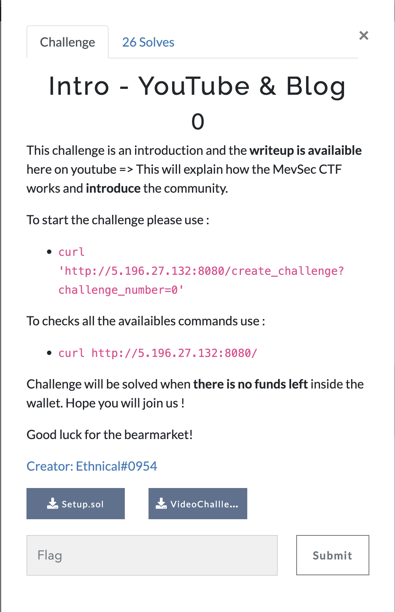

# MevSec writeup Introduction

<!--more-->

## Introduction

MevSec is a community focused on web3 security. To ensure the people has the require knowledge and permits to have a healthy community, we decided to create a CTF (Capture the Flag). The goal is to flag the challenges on the [ctf.mevsec.com](https://ctf.mevsec.com) to have at least 300 points. Once you get the <u>300</u> score points, you can join the community 😎  

Today, we will solve the first challenge together to show you how it works 🎉

The challenge statement is as follows:

> Challenge will be solved when there is no funds left inside the wallet. Hope you will join us !

## 1. Introduction

MevSec is a community focused on web3 security. To ensure the people has the require knowledge and permits to have a healthy community, we decided to create a CTF (Capture the Flag). The goal is to flag the challenges on the [ctf.mevsec.com](http://ctf.mevsec.com/) to have at least 300 points. Once you get the <u>300</u> score points, you can join the community 😎

---

## 2. Solidity challenge

Today, we will solve the first challenge together to show you how it works.

The challenge statement is as follows:

> *Challenge will be solved when there is no funds left inside the wallet. Hope you will join us !*
> 



First, we need to download the challenge, and open it our favorite text editor. 


The `setup.sol` is the contract that will initialized the contract (this contract is used by the team to generate the challenge and showing what is necessary to solve the challenge). 

```solidity
contract Setup {
	VideoChallengeIntro public vci;

	constructor() payable {
		require(msg.value >= 100, "Not enough ETH to create the challenge..");
		vci = (new VideoChallengeIntro){ value: 100 ether }();
	}

	function isSolved() public view returns (bool) { //IsSolved() need to return `true` to solve the challenge.
		return address(vci).balance == 0;
	}
}
```

The setup will create the challenge by creating the contract  `VideoChallengeIntro` in the line: 

```solidity
vci = (new VideoChallengeIntro){ value: 100 ether }(); //In this Challenge, 100 ether has been sent to the contract.
```

If we are looking closely the function `isSolved()` This function will return `true` , if the balance of the challenge is set to **0**.

> We can directly see that the goal of the challenge is to empty the balance of contract `VCI`.
> 

Now, the file `VideoChallengeIntro.sol` this file contains the contract `VideoChallengeIntro` :

```solidity
contract VideoChallengeIntro { //The VaultMEVSec contains 100ETH could you succeed to steal them?
	address public owner;
	
	modifier onlyOwner() {
		require(msg.sender == owner);
		_;
	}
	constructor() payable {
		require(msg.value == 100 ether, "100ETH required for the start the challenge");
		owner = msg.sender; // Set the Owner when we call the constructor
	}
	function balance() public view returns (uint256) {
		//Return the Balance of the contract.
		return address(this).balance;
	}
	function withdraw() public onlyOwner {
		//Only the owner can withdraw the contract balance.
		payable(owner).transfer(address(this).balance); // Transfer the balance to the owner
	}
	function setOwner() public {
		//Set the owner of the contract.
		owner = msg.sender;
	}
}
```

We can clearly see that the function `withdraw()` will transfer all the funds (the 100 ether inside in the contract). However, this function is protected by the `modifier onlyOwner()` meaning only the owner of the contract can call this function...

Here, this our lucky day because the contract implement a function `setOwner()` not protected.. Meaning anyone can call the function and take the owner of the current contract.

So to exploit the contract we can do the following steps:

1) Become `owner` by calling the function `SetOwner()` .

2) Steal the ALL the ether from the contract by calling the function `withdraw()` . 

Now how to do it using the infrastructure of MevSec and flag the challenge? 

To start the challenge we need to use `curl` :

```bash
curl 'http://5.196.27.132:8080/create_challenge?challenge_number=0'
```


Then, we will all the necessary informations to solve the challenge.

| Parameters |  |
| --- | --- |
| `RPC` link created for the challenges. | http://ctf.mevsec.com:50323/ |
| `Setup Address` contract | The address of the Setup contract, if you need the address of the real challenge contract just check the storage or call the variable vci() (we will do later on this demo) |
| `Contract Address` Ethereum (20 bytes) of the challenger | 0x133756e1688E475c401d1569565e8E16E65B1337 |
| `Private key` of the challenger to sign transaction and discuss with the blockchain | 0xedbc6d1a8360d0c02d4063cdd0a23b55c469c90d3cfbc2c88a015f9dd92d22b3 |
| `UniqueID` The unique instance that will be created for you and will be running for 20 minutes. | d3e87459ba9a4e54b6b74b2946dfb3f133fafdc4dcd715ebd2024642117e076a |

---

## 3. Process to flag.

1) Using `cast` we can get the contract *vci* by using the `RPC` and the `Contract Address` using the signature `vci()` .


2) Using `cast` we get the balance using the using the `RPC` and the address of the challenge.


3) Using `cast` we can send a transaction to the address of the challenge and calling the function `setOwner()` using  `RPC` and the `Private Key`

`")

4) Using `cast` we can send a transaction to the address of the challenge and calling the function `withdraw()` using  `RPC` and the `Private Key`

`")

5) Using the curl on the `curl 'http://5.196.27.132:8080/` we can see all the possible options.


6) To flag the challenge because we have call `withdraw()` and we steal all the funds we need to use `curl` with the `/get_flag` on our `UniqueID`.

> Reminder the instances will be destroy after 20 minutes, don’t hesitate to recreate a instance.
> 


Voila! Now You got the flag! 😎 Now it's your turn starting to flag challenge the others to join us and also create new challenges for the new comers! 🔥 \
Good luck!

## 4. Socials.

| Discord (Join us!) | Github | Twitter | 
| ----------------------------- | ------ | ---------- | 
| https://discord.gg/54Q9pnpQcV |  https://github.com/Ethnical/Swek3      |  https://twitter.com/EthnicalInfo |

