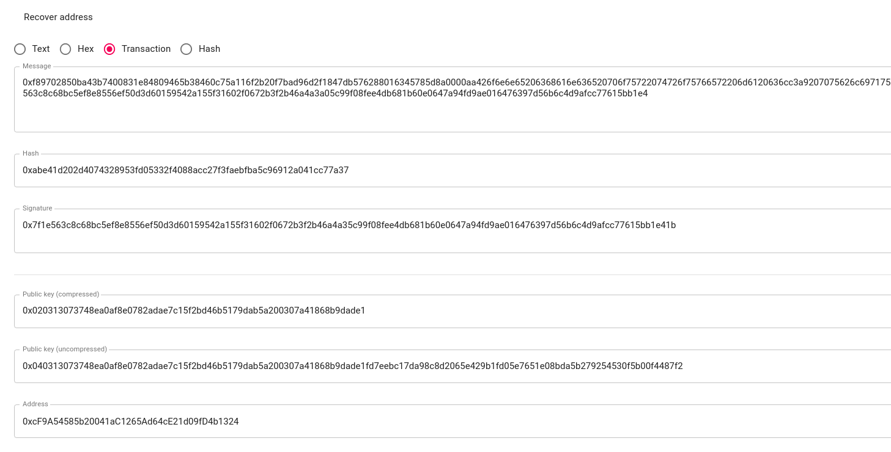

# Writeup 404CTF 2022 - public key (web3)

<!--more-->

## Statement

The challenge statement is as follows:
> Agent, we have prepared an exercise to check your understanding of the blockchain, because the practical aspect is important but the theoretical part is just as important.
>
> Contract at the address: 0x9Eb8F52b22024003C1312ea1569cf14208f3c30A
>
> Ropsten test network
>
> Warning, this challenge uses a test blockchain (Ropsten network).
> Under NO circumstances should you use real cryptocurrencies for this challenge.
> We are not responsible for any loss you might suffer if you do so.
> If you have real cryptocurrencies, we strongly advise you to create a new wallet dedicated to these challenges.


The source code of the smart contract is given:

```solidity
pragma solidity 0.8.13;

contract publicKey{

    address private secretAddress;

    constructor(address _secretAddress){
        secretAddress = _secretAddress;
    }

    function isPublicKey(bytes memory mystery) external view returns(bool){
        require(address(uint160(uint256(keccak256(mystery)))) == secretAddress, "Essayez encore !");
        return true;
    }
}
```

## Exploitation

The source code is short and contains one variable and one function. Before explaining the source code when need to understand how the address, public key and private key work in Solidity.

There are three steps to generate a new wallet:

- First, a **private key** is generated, it is composed of **64 hexadecimal characters** (i.e fad9c8855b740a0b7ed4c221dbad0f33a83a49cad6b3fe8d5817ac83d38b6a19).
- Then, from the private key with the algorithm ECDSA, the **public key** is generated, it is composed of **128 hexadecimal characters** (i.e 9a7df67f79246283fdc93af76d4f8cdd62c4886e8cd870944e817dd0b97934fdd7719d0810951e03418205868a5c1b40b192451367f28e0088dd75e15de40c05). Sometimes the **public key** can be compressed to save memory space ([source](https://ethereum.stackexchange.com/questions/103482/what-is-the-difference-between-compressed-and-uncompressed-public-key))
- Finally, the wallet **address** is generated from the **public key**. In solidity, this can be done as follows `address(uint160(uint256(keccak256(publickey))))`. This code takes the keccak256 hash of the public key and converts it to a 160-bit number. This number is then converted to a 20-byte address. For example, the `keccack256` of the previous public key is 793d56a696967d8f0833fd6296216849c49358b10257cb55b28ea603c874b05e ([several tools online can get the keccack256 hash](https://emn178.github.io/online-tools/keccak_256.html)). The address is the last 40 characters (96216849c49358b10257cb55b28ea603c874b05e)

By knowing all this, the `isPublicKey` function takes a public key as parameter, get the address from it and compare it with the `secretAddress` variable.

The exploitation can be done in two steps.

1. Retrieving the secretAddress variable
   In solidity contract nothing is really private. Even if the visibility of the variable has been set to private, the variable is still accessible. Web3 clients has a method called `StorageAt` (or something similar depending of the language) that can be used to retrieve a hex string at a specific slot in the contract.

Beforehand, I forked the blockchain for faster performance and easier debugging.

```bash
npx hardhat node --fork https://ropsten.infura.io/v3/<APIKEY>
#or
anvil --fork-url https://ropsten.infura.io/v3/<APIKEY>
```

The storage can be retrieved with cast from foundry:

```bash
cast storage 0x9Eb8F52b22024003C1312ea1569cf14208f3c30A 0
0x000000000000000000000000cf9a54585b20041ac1265ad64ce21d09fd4b1324
```

or in golang

```go
package main

import (
	"context"
	"encoding/hex"
	"errors"
	"flag"
	"fmt"
	"log"
	"math/big"

	"github.com/ethereum/go-ethereum/common"
	"github.com/ethereum/go-ethereum/crypto"
	"github.com/ethereum/go-ethereum/ethclient"
)

var fork bool

func main() {
	var blockchainURL, contractAddress string
	flag.BoolVar(&fork, "fork", true, "Should we use the parameter for the fork blockchain ? (default: true)")
	flag.Parse()
	contractAddress = "0x9Eb8F52b22024003C1312ea1569cf14208f3c30A"
	if fork {
		blockchainURL = "http://127.0.0.1:8545"
	} else {
		blockchainURL = "https://ropsten.infura.io/v3/<APIKEY>"

	}
	client, err := ethclient.Dial(blockchainURL)
	if err != nil {
		log.Fatal(err)
	}
	// Contract
	contractAddressHash := common.HexToAddress(contractAddress)

	storageContent, _ := client.StorageAt(context.Background(), contractAddressHash, common.BigToHash(big.NewInt(0)), nil)
	fmt.Println("secretAddress:", common.Bytes2Hex(storageContent))
}
```

which returns the same value. We know that the `secretAddress` is `0xcf9a54585b20041ac1265ad64ce21d09fd4b1324`.

2. An important thing about a transaction on the blockchain, is that **each transaction** is **signed** with the private key of the sender. The **sender's public key** is also included in the **signature**. If the node is not able to verify the signature, it will not accept the transaction. At this point, if the address `0xcf9a54585b20041ac1265ad64ce21d09fd4b1324` has sent a transaction, we will be able to retrieve its public key. Lucky we are, it has sent four transactions ([ropsten.etherscan.io](https://ropsten.etherscan.io/address/0xcf9a54585b20041ac1265ad64ce21d09fd4b1324)).

We need to recover the raw transaction that has been send by `0xcf9a54585b20041ac1265ad64ce21d09fd4b1324`. For some unknown reason etherscan can't [retrieve the raw transaction](https://ropsten.etherscan.io/getRawTx?tx=0x0a9a1a08bd3beda768824b667573436893912c97931ce18b240ed478216f458d).

But we can do it with any language with a web3 module.

```go
...
	// Get the raw transaction in hex
	txHash := common.HexToHash("0x3e641c314c4ffdfedad05dcee63910aa846711730b0c7366feb635b2e16b5cdb")
	tx, _, _ := client.TransactionByHash(context.Background(), txHash)
	rawTXBytes, _ := tx.MarshalBinary()
	fmt.Println("Raw data =>", common.Bytes2Hex(rawTXBytes))
...
```

```
Raw data => f89702850ba43b7400831e84809465b38460c75a116f2b20f7bad96d2f1847db576288016345785d8a0000aa426f6e6e65206368616e636520706f75722074726f75766572206d6120636cc3a9207075626c697175651ba07f1e563c8c68bc5ef8e8556ef50d3d60159542a155f31602f0672b3f2b46a4a3a05c99f08fee4db681b60e0647a94fd9ae016476397d56b6c4d9afcc77615bb1e4
```

[An online tool](https://toolkit.abdk.consulting/ethereum#rlp,recover-address) can do the math for us to retrieve the public key from the transaction.



In golang, no public function is available to recover the public key of a transaction. However, a private function in [transaction_signing](https://github.com/ethereum/go-ethereum/blob/4b309c70065e68321f6ba518f35b0454a5c929a9/core/types/transaction_signing.go#L482) named `recoverPlain` return, from the raw transaction, the address of the sender after calculating the public key (I leave as an exercice for the reader to see how the internal works. The first called function is [Sender of the london signer type](https://github.com/ethereum/go-ethereum/blob/4b309c70065e68321f6ba518f35b0454a5c929a9/core/types/transaction_signing.go#L184))

```go
package main

import (
	"context"
	"errors"
	"flag"
	"fmt"
	"log"
	"math/big"

	"github.com/ethereum/go-ethereum/common"
	"github.com/ethereum/go-ethereum/core/types"
	"github.com/ethereum/go-ethereum/crypto"
	"github.com/ethereum/go-ethereum/ethclient"
)

var fork bool

func main() {
	var blockchainURL, contractAddress string
	flag.BoolVar(&fork, "fork", true, "Should we use the parameter for the fork blockchain ? (default: true)")
	flag.Parse()
	contractAddress = "0x9Eb8F52b22024003C1312ea1569cf14208f3c30A"
	if fork {
		blockchainURL = "http://127.0.0.1:8545"
	} else {
		blockchainURL = "https://ropsten.infura.io/v3/<APIKEY>"

	}
	client, err := ethclient.Dial(blockchainURL)
	if err != nil {
		log.Fatal(err)
	}
	// Contract
	contractAddressHash := common.HexToAddress(contractAddress)

	storageContent, _ := client.StorageAt(context.Background(), contractAddressHash, common.BigToHash(big.NewInt(0)), nil)
	fmt.Println("secretAddress:", common.Bytes2Hex(storageContent))

	// Get the raw transaction in hex
	txHash := common.HexToHash("0x3e641c314c4ffdfedad05dcee63910aa846711730b0c7366feb635b2e16b5cdb")
	tx, _, _ := client.TransactionByHash(context.Background(), txHash)
	rawTXBytes, _ := tx.MarshalBinary()
	fmt.Println("Raw data =>", common.Bytes2Hex(rawTXBytes))
	v, r, s := tx.RawSignatureValues()
	//fmt.Println(recoverPlain(a.Hash(), r, s, v, true))
	var z types.FrontierSigner
	calculatedSenderAddress, _ := recoverPlain(z.Hash(tx), r, s, v, true)
	fmt.Println("Calculated sender address =>", calculatedSenderAddress)
}

// recoverPlain attempts to recover the public key from the signature.
// From https://github.com/ethereum/go-ethereum/blob/4b309c70065e68321f6ba518f35b0454a5c929a9/core/types/transaction_signing.go#L482
func recoverPlain(sighash common.Hash, R, S, Vb *big.Int, homestead bool) (common.Address, error) {
	if Vb.BitLen() > 8 {
		return common.Address{}, errors.New("Invalid Sig")
	}

	V := byte(Vb.Uint64() - 27)
	if !crypto.ValidateSignatureValues(V, R, S, homestead) {
		return common.Address{}, errors.New("Invalid Sig")
	}
	// encode the signature in uncompressed format
	r, s := R.Bytes(), S.Bytes()
	sig := make([]byte, crypto.SignatureLength)
	copy(sig[32-len(r):32], r)
	copy(sig[64-len(s):64], s)
	sig[64] = V
	// recover the public key from the signature
	pub, err := crypto.Ecrecover(sighash[:], sig)
	fmt.Println("Recovered public key =>", common.Bytes2Hex(pub))
	if err != nil {
		return common.Address{}, err
	}
	if len(pub) == 0 || pub[0] != 4 {
		return common.Address{}, errors.New("invalid public key")
	}
	var addr common.Address
	copy(addr[:], crypto.Keccak256(pub[1:])[12:])
	return addr, nil
}
```

```
...
Recovered public key => 040313073748ea0af8e0782adae7c15f2bd46b5179dab5a200307a41868b9dade1fd7eebc17da98c8d2065e429b1fd05e7651e08bda5b279254530f5b00f4487f2

Calculated sender address => 0xcF9A54585b20041aC1265Ad64cE21d09fD4b1324
```

You can notice, that to convert the public key to an address, the first bytes (two characters) are ignored. This is because the `04` is a tag bytes for the ASN.1 OCTET String structure.

We can check the public key by sending it the contract with the `cast` command of the foundry binaries.

```bash
cast send 0x9Eb8F52b22024003C1312ea1569cf14208f3c30A "isPublicKey(bytes)" "0313073748ea0af8e0782adae7c15f2bd46b5179dab5a200307a41868b9dade1fd7eebc17da98c8d2065e429b1fd05e7651e08bda5b279254530f5b00f4487f2" --rpc-url http://localhost:8545  --private-key 0x.....
```

